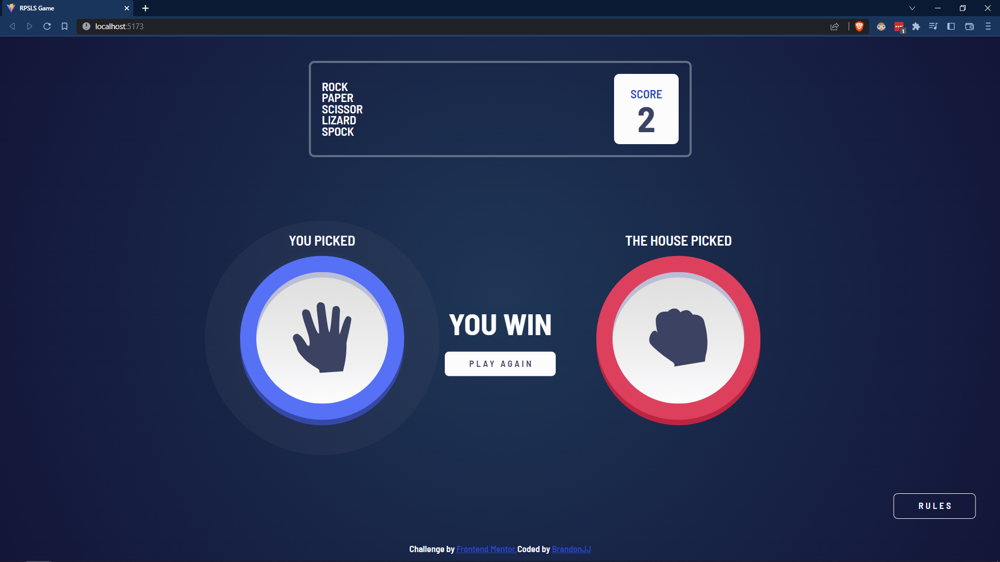

# Rock, Paper, Scissors solution

Esta es mi solución al reto [Rock, Paper, Scissors challenge de Frontend Mentor](https://www.frontendmentor.io/challenges/rock-paper-scissors-game-pTgwgvgH). 

## Tabla de contenido

- [Rock, Paper, Scissors solution](#rock-paper-scissors-solution)
  - [Tabla de contenido](#tabla-de-contenido)
  - [Overview](#overview)
    - [El reto](#el-reto)
    - [Screenshot de la solución](#screenshot-de-la-solución)
    - [Links](#links)
  - [El proceso](#el-proceso)
    - [Build with](#build-with)
    - [What I learned](#what-i-learned)
      - [¿Cómo usar PUG con Vitejs?](#cómo-usar-pug-con-vitejs)
      - [¿Cómo usar SASS con Vitejs?](#cómo-usar-sass-con-vitejs)
    - [Continued development](#continued-development)
    - [Useful resources](#useful-resources)
  - [Author](#author)
## Overview

### El reto

El reto se centró en construir el juego piedra, papel o tijeras con dos movimientos adicionales (lizard y spock) y con las siguientes características: 

- Diseño responsive
- Jugar piedra, papel o tijeras contra la computadora
- Mantener el score o puntaje del jugardor aún cuando se recargue la página.

### Screenshot de la solución



### Links

- Live Site URL: [scissorpapergame.netlify.com](https://scissorpapergame.netlify.com)

## El proceso

### Build with

- HTML5 semántico
- CSS 
- Flexbox
- CSS Grid
- Pug - Preprocesador HTML
- Sass - Preprocesador CSS
- BEM - Metodología para el nombramiento de clases en CSS 
- Mobile-first workflow
- NPM - Gestor de paquetes
- [Vite](https://vitejs.dev/) - Empaquetador JS
- [Git y Github](https://github.com/) - Control de versiones
- [Netlify](https://netlify.com/) - Deploy

### What I learned

Aprendí a usar Vitejs, SCSS y PUG los cuales brindan una buena experiencia de desarrollo, quizá no para proyectos pequeños como este, pero si suponen una gran ventaja a la hora de reutilizar código, además quería poner a prueba lo que aprendí en los cursos de [Platzi](https://platzi.com).

Tuve que investigar por mi cuenta como usar pug de la mano con vitejs, entonces llegué a encontrar la siguiente solución:

#### ¿Cómo usar PUG con Vitejs?

Para usar Pug con Vitejs necesitamos instalar dos dependencias que serían las siguientes:
```bash
npm install pug
npm install vite-plugin-pug
```

Después tenemos que configurar el archivo vite.config.js de la siguiente manera:

```javascript
import { defineConfig } from "vite"
import pugPlugin from "vite-plugin-pug"

export default defineConfig({
  plugins: [pugPlugin()],
})
```

#### ¿Cómo usar SASS con Vitejs?

Para usar sass es un poco más simple, basta con instalar la siguiente dependencia:
```bash
npm install sass
```

### Continued development

La siguiente tecnología que estoy aprendiendo se llama TypeScript que es como un JS pero con tipado.


### Useful resources

- [Guía de código](https://acortar.link/qp8XBM) - Me base en esta guía de código para programar de tal manera que sea entendido por cualquier persona. Además me ayudó a ordenar y organizar mis archivos.
- [ChatGPT](https://openai.com/blog/chatgpt) -  Esta herramienta de AI fue muy útil cuando se me presentaron errores que no entendía o sabía solucionar. ¿Pude haber indagado en Google? Sí, pero con ChatGPT el proceso fue más ágil, por supuesto que tiene defectos y algunas veces te responde información desactualizada, pero por lo menos te da una guía, una idea de en donde buscar o en donde podría estar el error.
- [Animation CheatSheet](https://acortar.link/nyX20Y), [Transform CheatSheet](https://acortar.link/u9iiSA), [Transition CheatSheet](https://acortar.link/wee2bM) - Estos resúmenes sobre cómo usar animaciones me sirvieron bastante para hacer el preloader y todas las animaciones que se aprecian en mi solución


## Author

- Website - [Brandon James Huaman](https://www.brandonjj.com)
- Frontend Mentor - [@Brandon328](https://www.frontendmentor.io/profile/Brandon328)
- Twitter - [@BrandonJJ328](https://www.twitter.com/BrandonJJ328)
- Linkedin - [@BrandonJJ](https://www.linkedin.com/in/brandonjj/)
- Github - [@Brandon328](https://github.com/Brandon328)
